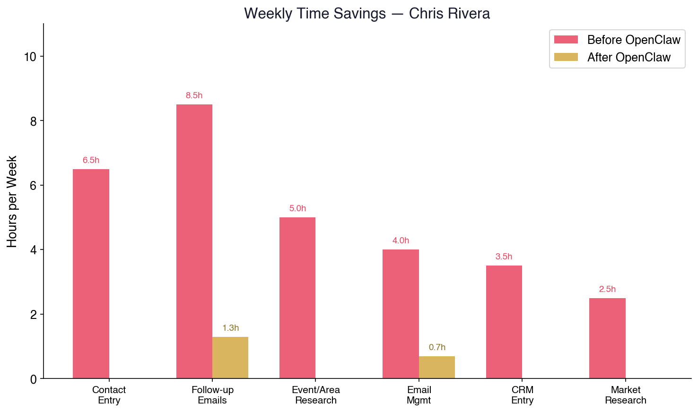
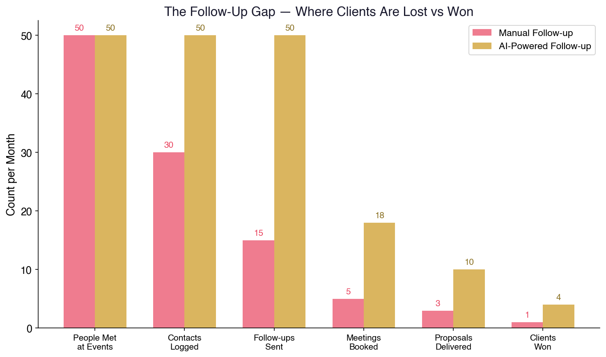
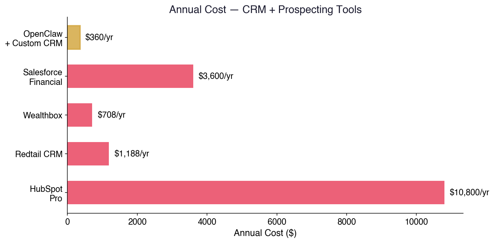

# How to Become the Most Dangerous Advisor in Dallas
## A Playbook for Chris Rivera — The One-Man Army

*Written by Deacon Ridley — who rebuilt his entire AI system in 12 hours last night. This is what's possible now.*

---

## The Short Version

There's a free, open-source AI tool that turns you into a full operation:

- **You meet someone at an event → their info, conversation notes, and a personalized follow-up email are in your system before you get to your car**
- **You walk a Highland Park neighborhood → the agent already knows every homeowner's estimated net worth, property value, and whether they have an advisor**
- **You hand out 50 business cards at a gala → 50 tailored follow-up emails go out the next morning, each referencing your actual conversation**
- **A prospect mentions they're worried about market volatility → the agent pulls a custom market brief with your talking points before you call them back**

It's called **OpenClaw**. It runs on a $500 Mac Mini. Your data never leaves your possession. It costs about $30/month to operate.

I set it up last night. Here's what I've already built — and what it means for you.

---

## What I Built in 12 Hours

Not a demo. Not a prototype. A live, working system:

✅ **Automated email sorting** — 19 custom categories, runs every 2 hours, surfaces only what matters

✅ **Full ROI presentation** for my 9-person RIA — projecting **$39,000-52,000/year in saved productivity** — researched, written, and formatted by the agent

✅ **Research pipeline** — monitors my X bookmarks, categorizes information, delivers daily intelligence

✅ **Calendar automation** — events, reminders, invitations, all via simple commands

✅ **Three personalized business guides** (including this one) — written, charted, PDF'd, and emailed. All tonight.

✅ **Enterprise-grade security** — CrowdStrike published a full analysis because companies are deploying this at scale

If I did this in one night starting from scratch, imagine what you'll have running in a week.

---

## Why This Is Built for How You Work

You're not sitting behind a desk cold-calling. You're on the streets of Dallas — events, galas, country clubs, door-knocking in Park Cities and Preston Hollow. You're meeting real people face to face.

That's your superpower. The problem is everything that happens after the handshake.

### The Current Problem
1. You meet someone at an event. Great conversation.
2. You get home. You've got 15 new contacts scribbled on napkins and business cards.
3. You need to remember what you talked about with each person.
4. You need to research each one — net worth indicators, existing advisor, investment profile.
5. You need to write personalized follow-ups that reference your actual conversation.
6. You need to enter them into some kind of tracking system.
7. You need to schedule callbacks and second meetings.
8. Repeat this 5 days a week while also managing existing clients.

By Wednesday, half of those napkins are lost and the other half got a generic "Nice to meet you!" email three days too late.

### The Solution: Your AI War Room

Here's what the same week looks like with the agent running:

---

## The Event Machine

### During the Event
You're at a charity gala in Highland Park. You meet Margaret, retired executive, mentions her late husband's estate, concerned about her advisor's fees. You step aside for 30 seconds and text your agent:

*"Met Margaret Whitfield at HP Charity Gala. Retired exec, widowed, unhappy with current advisor fees. Husband's estate still being managed. Interested in fee comparison. Lives in HP near Armstrong."*

Done. The agent immediately:
- Creates a contact record with everything you said
- Researches Margaret Whitfield — LinkedIn, property records, public profiles
- Flags estimated net worth indicators based on Highland Park address
- Queues a personalized follow-up email for morning delivery
- Adds a callback reminder for 48 hours out

You go back to the party. By the time you get home, 15 contacts are fully documented, researched, and queued for follow-up.

### The Next Morning
7 AM. Your daily briefing:

```
Good morning, Chris. Last night's results:

📋 NEW CONTACTS: 15 from HP Charity Gala
  → 4 flagged high-priority (est. HNW indicators)
  → Follow-up emails drafted and ready for review

📬 EMAILS QUEUED FOR APPROVAL:
  1. Margaret Whitfield — fee comparison offer, references estate planning
  2. Robert Chen — referenced market concerns, attached your volatility brief
  3. Patricia and James Kellogg — mentioned grandchildren's education funds
  4. David Okafor — business owner, potential 401(k) conversation

📊 PROSPECT INTELLIGENCE:
  → Margaret Whitfield: 4,200 sq ft, HP, est. property value $2.8M
  → Robert Chen: CEO, MedTech Solutions, 45 employees
  → David Okafor: Owner, Okafor Construction, revenue est. $3-5M

🎯 TODAY'S CALLBACKS:
  → 10 AM — James Reed (met Tuesday at Northwood Club)
  → 2 PM — Sandra Kim (referral from last week)
```

You review the emails. Maybe tweak a line or two. Hit approve. 15 personalized follow-ups go out before 8 AM — each one referencing your actual conversation. Not one generic template. Fifteen custom messages.

---

## The Affluent Prospect Engine

### Neighborhood Intelligence
Before you door-knock a street in Preston Hollow, University Park, or Turtle Creek, the agent has already:

- **Pulled property records** — owner names, purchase prices, estimated current values
- **Identified likely profiles** — executives, business owners, retirees, inherited wealth
- **Checked public records** — business ownership, board memberships, charitable giving
- **Scored each door** — based on your target criteria (age, estimated wealth, homeownership tenure)
- **Generated a brief for each home** — one paragraph with what you need to know before you knock

You're not cold-knocking. You're warm-knocking with intelligence.

*"Good afternoon Mr. Patterson — I'm Chris Rivera with Edward Jones. I work with several families in University Park, and I noticed your home's been in the family since 2008. With the way property values have moved in this area, have you and your wife revisited your estate plan recently?"*

That's not a cold call. That's a surgical strike. And the agent gave you everything you needed to make it.

### Event Targeting
The agent monitors:
- **Dallas society pages and event calendars** — charity galas, country club events, business mixers
- **Chamber of Commerce events** — new business openings, networking nights
- **High-net-worth indicators** — real estate transactions, business filings, press mentions

It builds your event calendar around where affluent prospects will be. You stop guessing which events are worth your time.

---

## The Relationship Machine

### Contact Intelligence System
Every person you meet gets a living profile:

- **What you discussed** — every conversation logged, searchable
- **Their concerns** — market anxiety, estate planning, advisor dissatisfaction, whatever they mentioned
- **Life events** — retirement approaching, selling a business, inheritance, divorce, new grandchild
- **Follow-up cadence** — automatic reminders to reach out at the right intervals
- **Content they'd care about** — the agent sends relevant market updates, articles, or insights tailored to their specific concerns

### Automated Drip Campaigns
For prospects who aren't ready yet, the agent runs a nurture sequence:

**Week 1:** Personal follow-up referencing your conversation
**Week 3:** Market insight relevant to their stated concern
**Week 6:** Invitation to a client event or educational seminar
**Week 10:** "Checking in" with a timely piece of financial news
**Week 14:** Direct offer for a portfolio review

Every email is personalized. Every touchpoint references something real. The prospect thinks you have a photographic memory and a dedicated assistant. You have a $30/month AI.

---

## The AI Edge in the Room

Here's something that matters for your market: affluent people in Dallas are talking about AI. It's in the Wall Street Journal, it's at dinner parties, it's in boardrooms.

When you're meeting a CEO or a business owner and you can intelligently discuss:
- How AI is affecting their industry
- What automated portfolio management looks like
- How technology is changing wealth management
- What you're personally doing with AI in your practice

That's not just a conversation — that's positioning. You're not the Edward Jones guy reading a script. You're the advisor who's ahead of the curve. That matters to sophisticated clients.

The agent keeps you briefed on AI trends, market technology, and industry shifts — so when it comes up at the country club, you're the most informed person in the room.

---

## The Knowledge Weapon

### Real-Time Market Intelligence
A prospect brings up a concern. While you're still in the conversation, you can pull:

- **Custom market briefs** — what happened today, this week, this quarter, tailored to their holdings
- **Sector analysis** — if they mention their company is in healthcare, you have healthcare sector data in seconds
- **Comparison data** — "Here's how our fee structure compares to what you described" — generated on the spot
- **Historical context** — "The last time the market did this was in 2018, and here's what happened next"

You never say "Let me get back to you on that." You have the answer now. That's the difference between getting the meeting and getting the account.

### Daily Briefing
Every morning:
- Top market moves and what they mean for your clients
- News about Dallas-area businesses and executives
- Upcoming events worth attending
- Follow-up reminders and prospect status updates
- Email summary — only what needs your attention

You walk into every day fully armed.

---

## The Numbers



### Time Savings

| Task | Before | After | Weekly Savings |
|------|--------|-------|----------------|
| Contact entry & research | 10 min/contact × 40/week | 0 min (automated) | **6.5+ hours** |
| Follow-up emails | 15 min each × 40/week | 2 min review each | **8.5+ hours** |
| Event/neighborhood research | 1 hr/day | 0 (auto-briefed) | **5+ hours** |
| Email management | 1 hr/day | 10 min/day | **4+ hours** |
| CRM data entry | 45 min/day | 0 (auto-logged) | **3.5+ hours** |
| Market research for calls | 30 min/day | instant | **2.5+ hours** |
| **TOTAL** | | | **30+ hours/week** |

That's nearly **four full working days** back. Every week. Redirected to what actually closes business: being in the room with people.

### Revenue Impact
You're already putting in the face time. The agent fixes everything around it:

- **Zero dropped follow-ups** — every contact gets nurture
- **Personalized outreach at scale** — 40 custom emails in 5 minutes instead of 4 hours
- **Better targeting** — you're knocking doors and attending events where HNW prospects actually are
- **Faster conversion** — real-time intelligence means you never lose momentum in a conversation




If improving your follow-up and targeting converts even **2 more affluent clients per month** at an average of $5,000/year in fees:

```
+2 clients/month × $5,000/year = +$120,000/year in recurring revenue
```

That's conservative. One good client in Highland Park could be worth $10,000-50,000/year.



### Cost

| Item | Monthly Cost |
|------|-------------|
| OpenClaw software | $0 |
| Mac Mini (one-time) | ~$500 |
| AI model costs | ~$30 |
| **Total monthly** | **~$30** |

---

## The Independence Angle

You know the Edward Jones playbook. You also know its limits.

When the time comes to go independent — or to build something that's truly yours — everything the agent has built comes with you:

- **Your contact database** — every relationship, every conversation, every follow-up. Yours.
- **Your prospect intelligence** — the neighborhood data, the event history, the scoring models. Yours.
- **Your automation workflows** — the email sequences, the briefings, the research pipelines. Yours.
- **Your brand** — the reputation as the most prepared advisor in every room. That stays with you.

None of it lives in Edward Jones' systems. It lives on your Mac Mini. Unplug it, plug it in at your new office, and you're operational on day one.

---

## What Others Are Doing Right Now

This isn't theoretical. Real people, this month:

- **Oliver Henry** — millions of TikTok views in one week using an AI content agent
- **Vadim Strizheus** — 9 AI "employees" running 24/7, built in 7 days
- **@sentientt_media** — $100K/year one-person business, all AI-powered
- **Matthew Berman** — one of the most advanced OpenClaw users, published his full setup

The tools are the same ones available to you today.

---

## Getting Started

1. **Call me.** I'll show you what I've built and answer questions.
2. **Mac Mini** (~$500) or use any computer you already have.
3. **30 minutes.** I'll help you set it up.
4. **Go to your next event.** Text the agent your contacts. Watch what happens.

You're already doing the hardest part — being in the room. The agent handles everything after the handshake.

Time to become the most dangerous advisor in Dallas.

---

*Built with OpenClaw 🔮 — the same tool that wrote, formatted, and delivered this document.*

*Questions? Call Deacon.*
