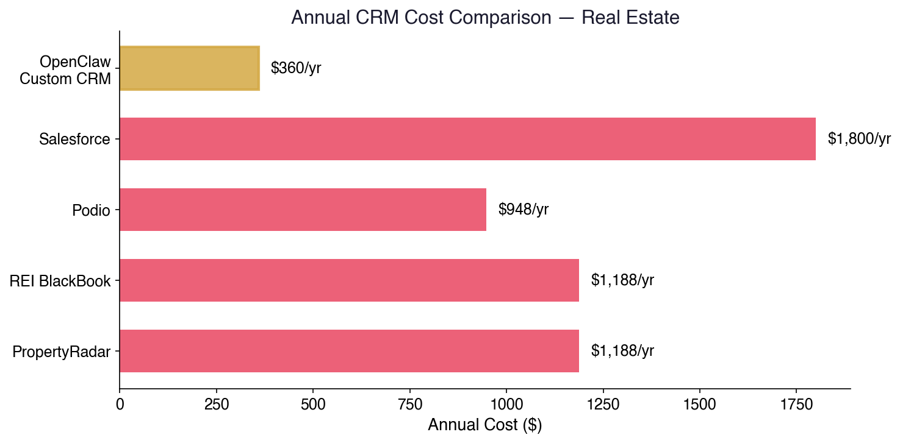
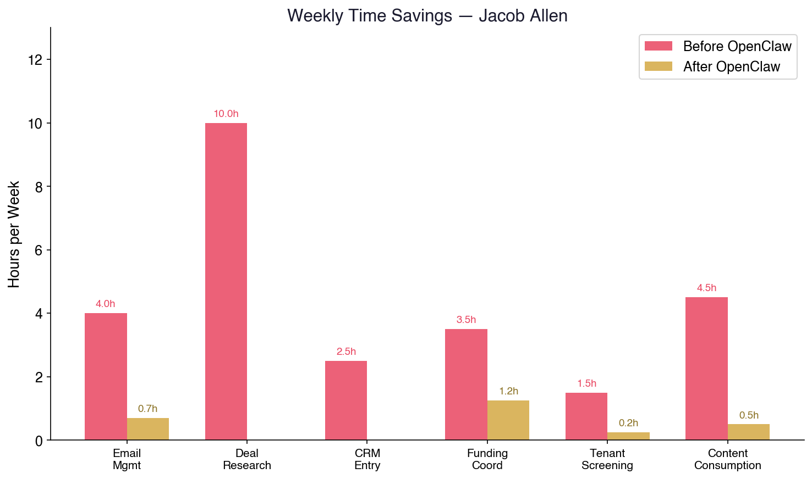
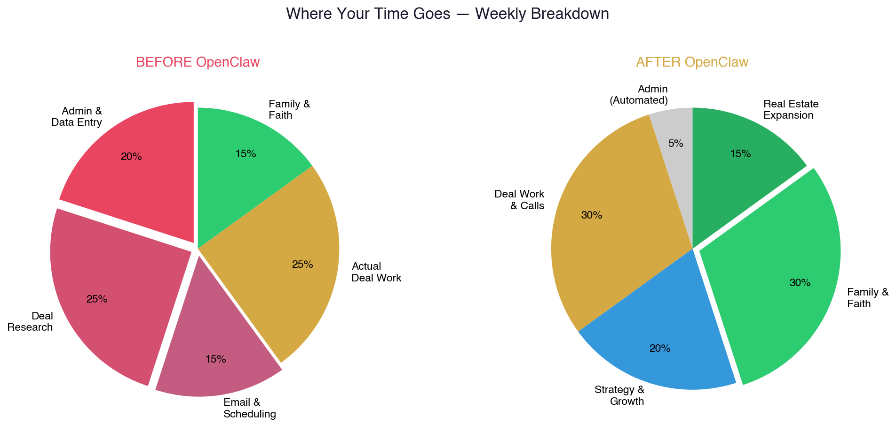
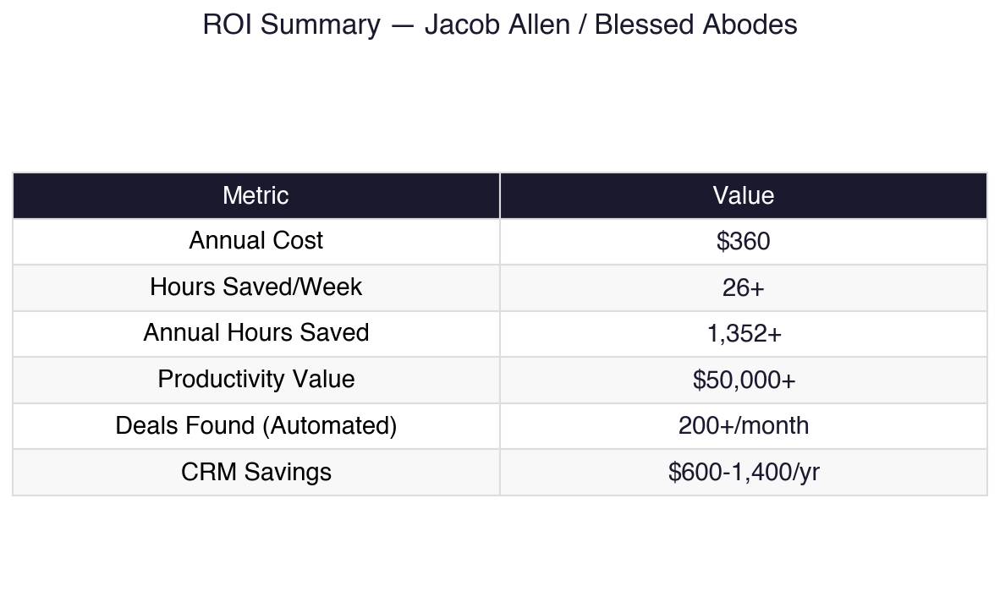

# Your Second Brain Is Ready
## A Personal AI Playbook for Jacob Allen — Advisor, Investor, Builder

*Written by Deacon Ridley — who built this entire system in one night and is now wondering why he didn't do it sooner.*

---

## The Honest Truth

You're running two businesses, raising a family, trying to grow spiritually, and somehow still expected to keep track of every deal, every vendor, every tenant, every appointment, and every email that comes through.

Something is always slipping. Not because you're not smart enough — because there's physically not enough of you to go around.

What if you had a second brain? One that never forgets. Never drops a follow-up. Never loses a contact. Reads your emails before you wake up and tells you only what matters. Summarizes a 5-hour YouTube video in 30 seconds. Coordinates your closings, your funding, your tenant screening — all from one place.

That's not hypothetical. I built it this week. It's called **OpenClaw**, and it's about to change how you operate.

---

## What This Actually Is

OpenClaw is a free, open-source AI agent that runs on a computer you own — a Mac Mini, a laptop, whatever. It connects to your email, your calendar, your files, and the internet. It runs 24/7. Your data never leaves your possession.

It costs about **$30/month** to operate. The software itself is free — forever.

Here's what it does for you, broken down by the parts of your life that need it most.

---

## Part 1: Your Second Brain

### The Problem
You're in a meeting with a lender. They reference a conversation from three weeks ago. You don't remember the details. You check your notes — scattered across your phone, an email thread, and a sticky note that's now in the trash.

### The Solution
The agent remembers everything. Every conversation. Every note. Every decision. It builds a living memory system that you can search instantly:

- **"What did I discuss with the seller on Oak Street last Tuesday?"** → Full summary with action items.
- **"When is the inspection deadline on the Elm property?"** → Date, time, inspector contact info.
- **"What was the interest rate First National quoted me?"** → 7.2% fixed, 30-year, quoted January 8th.

It's not just storing information — it organizes it, links it together, and surfaces what's relevant when you need it. Meeting notes auto-generate. Action items auto-track. Nothing gets lost.

### Daily Digest
Every morning at 7 AM, you get a briefing:

```
Good morning, Jacob. Here's your day:

📋 TODAY
• 9:00 AM — Call with Heritage Funding re: 412 Cedar financing
• 11:00 AM — Showing at 1847 Maple for tenant prospect (Sarah Mitchell)
• 2:00 PM — Closing on 903 Pine, title company confirmed

📬 EMAIL HIGHLIGHTS
• Heritage Funding sent updated term sheet (attached summary)
• Tenant application received for 6200 Oak — credit score 720, income verified
• Insurance renewal notice for 1847 Maple — due Feb 28

📰 MARKET INTEL
• 3 new foreclosure listings in your target zip codes
• Zillow price drop alert: 2 properties in 75024 reduced 10%+
• Interest rate update: 30-year fixed holding at 6.8%

🎯 FOLLOW-UPS DUE
• Call back Mike Torres (contractor) — estimate pending 3 days
• Send lease agreement to Johnson family — promised by today
• Submit insurance claim documentation for 412 Cedar
```

You haven't opened a single app. You know exactly what your day looks like and what needs attention. Inbox sorted, priorities clear, nothing forgotten.

---

## Part 2: Email & Scheduling on Autopilot

### Email Triage
The agent scans your inbox every 30 minutes. It:
- **Sorts** everything into categories (deals, tenants, funding, personal, junk)
- **Archives** the noise automatically
- **Flags** anything urgent and tells you why
- **Drafts responses** for routine emails — you review and hit send

What used to take 45 minutes of scrolling and sorting every morning becomes 5 minutes of review.

**And here's a bonus:** Deacon's agent can monitor your email too. Interesting opportunities, deals, articles, anything relevant — flagged and surfaced to you automatically. You don't even have to be checking. Your second brain is always watching, and it brings the important stuff to the front of your mind first thing in the morning so you're thinking about the right things that day.

### Smart Scheduling
Tell the agent: *"Schedule an inspection for 412 Cedar next week, morning preferred, and send the inspector my address."*

Done. Calendar updated. Email sent. Confirmation tracked. You didn't open Google Calendar. You didn't compose an email. You said one sentence.

### Auto Follow-Up
Set rules: *"If I haven't heard back from a lender in 48 hours, send a polite follow-up."*

The agent tracks every outbound communication and follows up on your behalf. Leads don't go cold because you got busy. Deals don't stall because you forgot to reply. The machine keeps everything moving.

---

## Part 3: Real Estate Deal Hunting

This is where it gets serious.

### The Scraping Machine
The agent can scan multiple sources continuously for deals that match your criteria:

- **Zillow & Redfin** — price drops, days on market, motivated seller signals
- **Foreclosure listings** — county records, auction sites, pre-foreclosure databases
- **Social media** — Facebook Marketplace, Craigslist, local investor groups
- **MLS data** — through API feeds or web scraping
- **Driving for dollars** — cross-reference property data with owner info, tax records, vacancy indicators

You define your buy box:
- Location: specific zip codes or radius
- Price: under $X
- Condition: distressed, estate sale, pre-foreclosure
- Equity: minimum estimated equity percentage

The agent watches 24/7. When something hits your criteria, you get an alert with a full property brief:

```
🏠 NEW DEAL ALERT

Address: 847 Birch Lane, Allen TX 75002
List Price: $189,000 (reduced from $215,000 — 3 price drops)
Zestimate: $235,000
Est. ARV: $260,000
Days on Market: 94
Owner: Estate of Margaret Wilson (probate filing found)
Tax Assessment: $198,000
Lot Size: 0.22 acres
Year Built: 1987

⚡ WHY THIS FLAGGED:
- 12% below Zestimate
- Estate/probate = motivated seller
- 90+ DOM = negotiation leverage
- In your target zip code

📞 Listing Agent: Tom Rivera, Keller Williams — (214) 555-0847
```

You're seeing deals before other investors because you're not manually searching — the machine is always watching.

### Comp Analysis
Before you make an offer: *"Pull comps for 847 Birch Lane, 3-bed 2-bath within half a mile, last 6 months."*

The agent pulls comparable sales, calculates your ARV, estimates rehab costs based on the property profile, and gives you a max offer number. What used to take 30 minutes of Zillow browsing and spreadsheet work takes 10 seconds.

---

## Part 4: Funding Coordination

Once you've got a deal, the real coordination begins. You're juggling:
- Hard money lenders
- Private investors
- Title companies
- Insurance agents
- Contractors
- Appraisers

The agent becomes your project manager:

### Deal Pipeline Tracker
```
┌─────────────────────────────────────────────────┐
│           847 BIRCH LANE — DEAL STATUS           │
│                                                   │
│  [✅] Offer accepted — $175,000                   │
│  [✅] Hard money term sheet — Heritage Funding     │
│  [✅] Title search ordered — Lone Star Title       │
│  [🔄] Inspection scheduled — Feb 18, 9 AM         │
│  [🔄] Insurance quote requested — 2 companies     │
│  [⏳] Appraisal — pending lender order             │
│  [⏳] Contractor walkthrough — scheduling          │
│  [⏳] Closing — target March 1                     │
└─────────────────────────────────────────────────┘
```

Every party's contact info, every document, every deadline — tracked in one place. The agent sends reminders when deadlines approach, follows up with vendors who haven't responded, and alerts you when something is at risk of slipping.

### Document Management
Loan applications, term sheets, title commitments, inspection reports, insurance binders — the agent files everything automatically, links it to the right property, and can pull any document instantly when you ask.

---

## Part 5: Tenant Acquisition & Vetting

House is ready. Now you need qualified tenants.

### Advertising
The agent can:
- **Draft property listings** with photos, descriptions, and pricing
- **Post to multiple platforms** — Zillow Rental Manager, Facebook Marketplace, Craigslist, Apartments.com
- **Respond to inquiries** automatically with showing times and qualification requirements
- **Schedule showings** and send reminders to prospects

### Physical Marketing — Hire a Human
Need signs placed on a specific block? Flyers distributed in a neighborhood?

There's a service called **HireAHuman** where AI-generated tasks get fulfilled by real people. You tell the agent: *"I need 20 'For Rent' signs placed within a 1-mile radius of 847 Birch Lane this Saturday."*

The agent creates the task, hires someone to do it, and confirms completion. You never made a phone call. You never drove anywhere. Signs are up.

Need a door-knocking campaign in a specific subdivision? Flyers in mailboxes? Bandit signs at intersections? Same workflow. You describe what you need, the agent coordinates the humans to execute it.

### Tenant Screening
Application comes in. The agent:
- Verifies income documentation
- Checks credit score against your minimum threshold
- Cross-references rental history
- Flags any inconsistencies
- Generates a summary: **"Sarah Mitchell — 720 credit, $65K income, 3x rent ratio met, clean rental history, recommended: APPROVE"**

You make the final call, but 90% of the vetting work is already done.

---

## Part 6: Custom CRM for Blessed Abodes

This is the system that ties everything together.

### Architecture
```
┌──────────────────────────────────────────────────────┐
│           BLESSED ABODES COMMAND CENTER               │
│                                                        │
│  ┌──────────┐  ┌──────────┐  ┌───────────────────┐   │
│  │ Property  │  │  People  │  │    Deal Pipeline  │   │
│  │    DB     │  │    DB    │  │     Tracker       │   │
│  └────┬─────┘  └────┬─────┘  └────────┬──────────┘   │
│       │              │                  │              │
│  ┌────┴─────┐  ┌────┴─────┐  ┌────────┴──────────┐   │
│  │ Zillow   │  │ Tenants  │  │  Funding Sources   │   │
│  │ Redfin   │  │ Sellers  │  │  Hard Money        │   │
│  │ MLS Data │  │ Lenders  │  │  Private Investors  │   │
│  │ Tax Data │  │ Vendors  │  │  Banks              │   │
│  └──────────┘  └──────────┘  └────────────────────┘   │
│                                                        │
│  ┌──────────┐  ┌──────────┐  ┌───────────────────┐   │
│  │ Document  │  │ Marketing│  │   Financial        │   │
│  │  Vault   │  │  Engine  │  │   Dashboard        │   │
│  └──────────┘  └──────────┘  └───────────────────┘   │
│                                                        │
│  Interface: Telegram / Web / Voice                     │
│  Storage: Local (free, yours forever)                  │
│  AI Layer: OpenClaw (24/7 automation)                  │
└──────────────────────────────────────────────────────┘
```

### What Each Piece Does

**Property DB**
Every property you've looked at, made an offer on, own, or sold. Linked to live Zillow/Redfin data, tax records, mortgage info, insurance policies, tenant history. One search pulls everything.

**People DB**
Every contact in your world — tenants, sellers, lenders, contractors, investors, agents. Linked to their properties, their communication history, and their reliability rating.

**Deal Pipeline**
Visual tracker from "lead found" → "offer made" → "under contract" → "closing" → "rented" → "cash flowing." Every deal, every status, every deadline.

**Document Vault**
Every lease, every loan doc, every inspection report, every insurance policy. Auto-filed, auto-linked, instantly searchable.

**Marketing Engine**
Listing templates, email campaigns, social posts, sign placement coordination. One command generates materials for any property.

**Financial Dashboard**
Cash flow by property. Total portfolio value. Monthly income vs expenses. Vacancy rate. ROI per deal. Investor reporting ready.

### Cost
- Software: **$0**
- Database: **$0** (local storage)
- AI models: **~$30/month**
- Zillow/Redfin data: **Free** (public data scraping)



Compare that to any real estate CRM on the market — $50-200/month, limited customization, your data locked in their cloud.

---

## Part 7: Content Summarization & Learning

You want to grow — spiritually, intellectually, professionally. But there aren't enough hours.

### YouTube Summarization
A pastor you follow posts a 2-hour sermon. A real estate guru drops a 90-minute market analysis. An investor shares a 45-minute case study.

You tell the agent: *"Summarize this."* Paste the link. In 30 seconds you get:

- **Key points** (bullet list)
- **Action items** (what's relevant to you)
- **Notable quotes**
- **Your take** (based on what the agent knows about your interests)

You just consumed 2 hours of content in 2 minutes. The important stuff is saved to your knowledge base. The rest is discarded.

### Book Summaries & Reading Lists
Want to read more but can't find the time? The agent can:
- Summarize books from available sources
- Create reading lists based on your interests
- Track what you've read and surface relevant highlights when they apply to current situations

### Daily World Briefing
Customized to what actually matters to you — not what CNN thinks matters:
- Real estate market trends in your target areas
- Interest rate movements
- Local economic indicators
- Faith and family content from sources you trust
- Political developments that affect your business

Delivered every morning before your first cup of coffee.

---

## Part 8: Marketing & Investor Relations

When it's time to scale — to raise capital, attract investors, and build the Blessed Abodes brand — the agent becomes your marketing department.

### Investor Materials
- **Pitch decks** — auto-generated with your portfolio data, returns, and projections
- **Deal packages** — property briefs with comps, rehab estimates, and projected returns formatted for investor review
- **Monthly reports** — portfolio performance, cash flow, occupancy rates — sent automatically to your investor list

### Email Campaigns
- **Drip sequences** for potential investors — educational content about real estate investing, your track record, opportunities
- **Property announcements** — new deals available for investment, formatted professionally
- **Tenant marketing** — vacancy ads across multiple platforms with one command

### Scripts & Templates
Need a cold call script for a motivated seller? A follow-up email after an investor meeting? A lease renewal notice? The agent writes it, you review it, it sends it.

The goal: **you get on planes and sit across from investors.** Belly to belly. Face to face. That's where trust is built and deals are closed. Everything else — the research, the materials, the follow-up — the machine handles while you're in the air.

---

## Part 9: The Real Point

Let's step back from the technology for a minute.

You're a man of faith trying to build something that provides for your family and serves a purpose. The daily grind of emails, data entry, deal tracking, and administrative busywork isn't just annoying — it's stealing time from the things that actually matter.

Time with your family. Time in the Word. Time building relationships that have eternal significance. Time thinking clearly about where God is leading you instead of drowning in spreadsheets.

This tool doesn't replace your judgment, your faith, or your relationships. It replaces the mechanical work that has nothing to do with any of those things. It frees your mind for what actually matters.

That's the real pitch. The ROI and the automation are just how it works. The why is freedom.

---

## The Numbers



### Time Savings (Weekly)

| Task | Before | After | Savings |
|------|--------|-------|---------|
| Email management | 1 hr/day | 10 min/day | **4+ hours** |
| Deal research & scraping | 2 hrs/day | 0 (automated) | **10+ hours** |
| CRM data entry | 30 min/day | 0 (auto-logged) | **2.5 hours** |
| Funding coordination | 1 hr/day | 15 min/day | **3.5 hours** |
| Tenant screening | 2 hrs/week | 15 min/week | **1.5 hours** |
| Content consumption | 5 hrs/week | 30 min/week | **4.5 hours** |
| **TOTAL** | | | **26+ hours/week** |

That's more than **three full working days** back. Every single week.






### Cost

| Item | Cost |
|------|------|
| OpenClaw software | $0 (forever) |
| Mac Mini (one-time) | ~$500 |
| AI models | ~$30/month |
| **Total monthly** | **~$30** |

### What Deacon Already Built (In One Night)
- Automated email sorting across 19 categories
- Full ROI presentation for his 9-person advisory firm — projecting **$39,000-52,000/year in savings**
- Research pipeline that monitors and categorizes information automatically
- Calendar and scheduling automation
- Content creation tools including AI video generation
- Daily automated briefings

If I did this in one night, imagine what you'll have running in a week.

---

## Getting Started

1. **Read this.** (Done.)
2. **Call Deacon.** I'll show you what I've built and answer your questions.
3. **Get a Mac Mini** (~$500) or use any computer you already have.
4. **Block 30 minutes.** I'll help you set it up remotely.
5. **Start with email + daily digest.** You'll feel the difference immediately.

The technology exists. The cost is negligible. The only question is whether you want to keep grinding manually or free yourself up for the things that actually matter.

Blessed Abodes deserves a smarter operation. Your family deserves more of your time. And you deserve to stop being a human data entry clerk.

Let's build it.

---

---

# Bonus Section: A Note for Todd

*Jacob — send this whole document to your dad. This part is for him.*

---

## Todd, Read This.

You're an engineer at a weapons company. You're good at it. It pays the bills. But that's not what you're here for, and you know it.

What you're here for is to spread the Gospel of Jesus Christ. That's the mission. Everything else is logistics.

But right now, the logistics are winning. You've got a real estate portfolio that needs attention. You've got a day job that eats 50+ hours a week of mental bandwidth. You've got a world moving so fast that just staying informed feels like a second job. By the time you get home, the energy for ministry — the thing that actually matters eternally — is competing with everything that only matters temporarily.

Here's what changes with this tool.

### Your Real Estate Portfolio — Handled

Your properties are suffering because they need consistent attention you don't have. The same system Jacob is building can manage yours too:

- **Shared CRM** — your properties and Jacob's, all in one system. He's already doing the work. Your portfolio plugs right in.
- **Automated tenant management** — rent tracking, lease renewals, maintenance requests, vendor coordination
- **Financial dashboard** — cash flow per property, expense tracking, tax-ready reporting
- **Vacancy alerts & tenant screening** — the moment a tenant gives notice, the machine starts marketing and vetting replacements

You and Jacob can operate as a team. He handles the active deal-finding and acquisitions. Your existing portfolio runs on autopilot through the same system. One shared command center, two businesses benefiting. The family operation gets tighter, not more chaotic.

The real estate stops being a burden and starts being what it was supposed to be — passive income that funds the mission.

### Daily Information — Compressed

You're an informed man. You want to know what's going on in the world — politically, economically, spiritually. But consuming that information the normal way — scrolling news sites, watching hour-long videos, reading articles — takes hours you don't have.

The agent delivers a **custom daily briefing** every morning:

- **World events** filtered through what actually matters to you — not mainstream media's agenda
- **Market updates** relevant to your portfolio and investments
- **Faith content** — sermons, apologetics, ministry updates from sources you trust
- **Summarized videos** — that 2-hour podcast or 90-minute lecture becomes a 2-minute summary with the key points and notable quotes

You stay fully informed without spending a single minute scrolling. The noise is gone. Only signal.

### Content Creation — Your Evangelism Engine

This is the big one.

You want to evangelize. You want to create content that reaches people with the truth of Christ. But content creation has a massive overhead — scripting, recording, editing, posting, promoting. It feels like you need a whole media team.

You don't. You need this:

**Writing & Scripting**
- Tell the agent what's on your heart — a topic, a verse, a conversation you had. It drafts a script, a blog post, or social media content.
- Not replacing your voice — amplifying it. Your message, your conviction, your theology. The agent handles the formatting and structure.

**Video Content**
- AI video generation is here (Deacon's already set this up). Text-to-video. Image-to-video. Pair your message with compelling visuals without a camera crew.
- Short-form clips for YouTube Shorts, Instagram Reels, TikTok — the formats where people actually discover new voices.
- The agent can take a long-form teaching and automatically cut it into short, shareable clips with captions.

**Distribution**
- One piece of content → automatically reformatted and posted across every platform
- YouTube, X/Twitter, Instagram, Facebook, TikTok — the agent handles the posting schedule, the hashtags, the engagement tracking
- You create once. The machine distributes everywhere.

**Apologetics Research**
- Preparing to engage with skeptics? The agent can pull arguments, counter-arguments, scripture references, historical context, and theological sources in seconds.
- Building a teaching series? The agent researches, outlines, and organizes your material so you can focus on delivery.

**Audience Building**
- The agent can analyze which content resonates, which topics draw engagement, and what your audience is responding to
- Email list management — capture interested people, send follow-ups, build a community around the ministry
- Local outreach coordination — if you want to organize events, Bible studies, street evangelism, the scheduling and communication is automated

### Mental Bandwidth — The Real Freedom

Here's what your week looks like right now:

```
Monday-Friday: Engineering job (50+ hrs of mental energy)
Evenings: Real estate fires, bills, tenant issues
Weekends: Catching up on everything you couldn't do during the week
Ministry: Whatever scraps of time and energy are left
```

Here's what it looks like with the machine running:

```
Monday-Friday: Engineering job (same, but—)
  → Real estate runs itself through the shared CRM
  → Email sorted, bills tracked, maintenance auto-coordinated
  → Daily briefing consumed in 5 minutes over coffee
Evenings: FREE — family, scripture, ministry prep
Weekends: FREE — content creation, evangelism, rest
Ministry: Not the scraps. The priority.
```

The engineering job funds the mission. The real estate generates passive income for the mission. The AI handles the administrative weight of both. And you — you do what you were called to do.

### The Cost of Not Doing This

Every week that passes with your bandwidth consumed by logistics is a week that the Gospel isn't going out through you at full capacity. The people you're supposed to reach are still waiting. The content you're supposed to create is still unwritten. The ministry you're supposed to build is still in your head instead of in the world.

The tool costs $30/month. A Mac Mini costs $500. Setup takes an afternoon.

The return isn't measured in dollars. It's measured in souls reached, truth proclaimed, and a life aligned with what actually matters for eternity.

You know the verse: *"For what does it profit a man to gain the whole world and forfeit his soul?"* (Mark 8:36)

The inverse is also true — what does it profit a man to spend his life on administrative tasks when he was built for something greater?

### Getting Started — Together

1. **Read this document.** Jacob's going to build the real estate CRM that serves both of you.
2. **Talk to Jacob.** The shared system means your portfolio plugs into his operation — less work for both of you.
3. **Call Deacon.** I'll help you set up the content creation pipeline and daily briefing system.
4. **Start creating.** The world needs what you have to say. The machine handles everything else.

The harvest is plentiful, Todd. Let's make sure the workers aren't stuck doing data entry.

---

*Built with OpenClaw 🔮 — the same tool that wrote, formatted, and delivered this document.*

*Questions? Call Deacon or reply to this email.*
