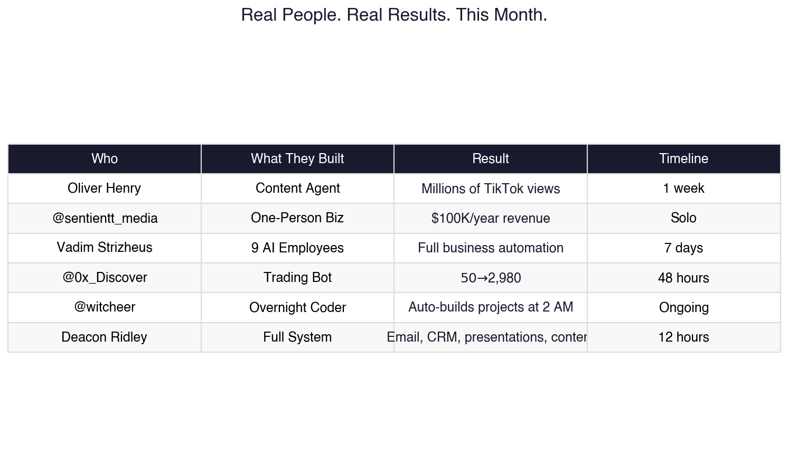
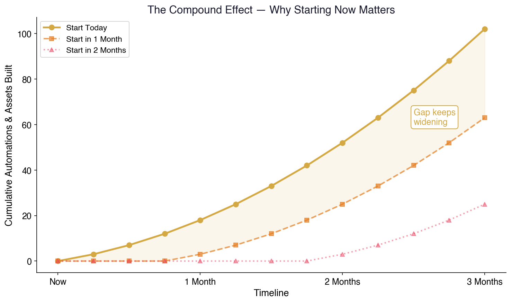
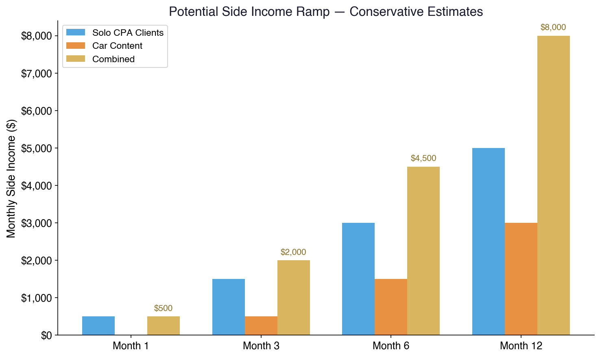
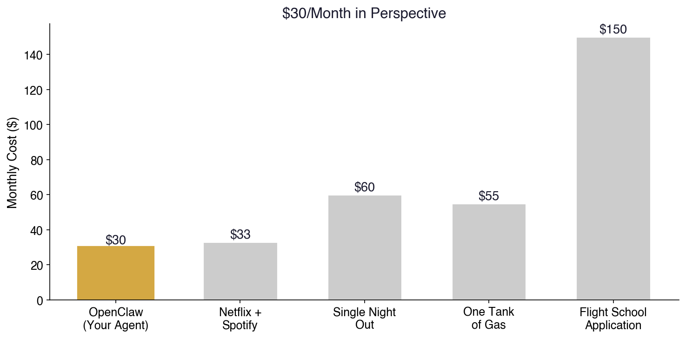

# Don't Just Listen to Me. Look at What's Happening.
## A Case for Jake Harker — CPA, Future Pilot, Skeptic

*Written by Deacon Ridley — who reset his entire system last night and rebuilt everything from scratch in 12 hours. Imagine what a week looks like.*

---

## I Know You're Skeptical

Good. You should be. Everyone's pitching AI tools right now, and 90% of it is hype from people who've never built anything real with it.

So I'm not going to pitch you. I'm going to show you what I did, show you what other people are doing right now, and let you draw your own conclusions. You're smart enough to figure out where this goes.

---

## What I Did in 12 Hours

I'm not exaggerating. I reset my entire AI system last night and rebuilt it from scratch. Here's what exists right now, 12 hours later:

- **Automated email sorting** across 19 categories — runs every 2 hours, no input from me
- **A full ROI presentation** for my 9-person financial advisory firm projecting $39,000-52,000/year in saved productivity — researched, written, formatted, and delivered by the agent
- **77 X/Twitter bookmarks** pulled via API, categorized into 10 topics, with daily monitoring set up
- **Two personalized business guides** (for two different friends in two different industries) — written, converted to PDF with custom charts, and emailed — all while I was working on other things
- **Calendar automation, reminders, daily briefings** — all running
- **Voice calls, video generation, content pipelines** — configured and ready
- **Enterprise security research** — CrowdStrike published a full analysis because companies are deploying this at scale

That's one night. One person. $30/month.

Now stop thinking about what I did and start thinking about what you could do.

---

## What Other People Are Actually Doing

Don't take my word for it. Here's what's happening right now, this month, from real people:

### The TikTok Guy
**Oliver Henry** — gave his AI agent a content strategy. It found trending topics, wrote scripts, generated videos, and posted them. **Millions of TikTok views in one week.** One person. One agent. Full step-by-step guide published publicly.

### The One-Man Business
**@sentientt_media** — built a $100K/year business using only Claude Opus 4.6 as his "employee." Shared the exact prompt publicly. One person. No team. No office.

### The 9-Agent Team
**Vadim Strizheus** — started with one agent on Day 1. By Day 7, he had 9 AI "employees" running 24/7. He published his full cost breakdown: token optimizations, what each agent does, the whole stack. He's generating content, managing operations, and scaling — all while being one person.

### The Overnight Coder
**@witcheer** — built a bot that reads his emails, pulls 18 RSS feeds, and at 2 AM every night, picks a project and builds it autonomously while he sleeps. He wakes up to completed work.

### The Trading Bot
**@0x_Discover** — gave an AI agent $50 and said "pay for yourself or you shut down." 48 hours later: **$50 turned into $2,980.** Autonomous trading on Polymarket. Still running.

### The Goldman Sachs Story
Some guy showed his Polymarket trading profile in a Goldman Sachs interview. $578,559 in profit over 4 months. Got the offer.

### The Free Vibe Coder
**@kaostyl** — figured out how to use AI coding agents with zero monthly cost. Legal. Working right now. Published the methods publicly.

These aren't hypothetical projections. These are real people, this month, sharing their results publicly on X/Twitter. The tools are the same ones available to you right now.



---

## Why This Matters for You Specifically

You're a CPA in your early 20s. You're smart — probably smarter than most of the people using these tools right now. But you're in debt, you want to fly, and you need a bridge from where you are to where you want to be.

Here's the thing about bridges: the earlier you start building, the sooner you cross.

### Path 1: CPA on Your Own Terms
You already know tax code, financial statements, and business structures better than 99% of people your age. What if you didn't need a firm to leverage that?

With this tool:
- **Client acquisition automated** — scrape local businesses that need CPA services, generate outreach, track leads
- **Tax prep accelerated** — AI reads documents, extracts data, fills forms, flags anomalies. You review and sign. What takes 2 hours takes 20 minutes.
- **Client communication on autopilot** — reminders for quarterly estimates, document requests, deadline alerts. Your clients think you have a full office staff. It's just you and the machine.
- **Bookkeeping as a service** — the agent categorizes transactions, reconciles accounts, generates reports. You sell the service, the agent does the grunt work.

A solo CPA practice with AI doing the labor is a real business with real margins. You keep your overhead near zero while you build up cash.

### Path 2: Content About Cars
You know cars. You're passionate about it. The content machine is here:

- **Video generation** — AI creates stunning car visuals from text descriptions. No camera, no studio, no budget required.
- **Script writing** — describe what you want to talk about, the agent writes a script optimized for YouTube or TikTok
- **Research** — the agent pulls specs, reviews, comparisons, market data on any car instantly
- **Posting & distribution** — one piece of content automatically reformatted and posted across YouTube, TikTok, Instagram, X
- **Monetization tracking** — the agent monitors which content performs, what your audience responds to, and optimizes

People are getting millions of views with AI-generated content right now. Not in theory. Right now. This month.

### Path 3: Whatever You Haven't Thought of Yet
This is the part that matters most.

The people winning with this tool aren't following a playbook someone else wrote. They're building things nobody expected. A trading bot that pays for itself. An overnight coding agent. A content empire run by one person.

You're going to find uses for this that I haven't thought of. That's not flattery — that's pattern recognition. You're the kind of person who reverse-engineers systems. This is the most powerful system available to reverse-engineer right now.

---

## The Compound Effect

Here's what the skeptic in you needs to hear:

This tool compounds. Every day it runs, it learns more about how you work. Every automation you set up frees time for the next one. Every piece of content generates data about what works. Every client interaction gets smarter.

The people who started 2 weeks ago already have:
- Memory systems that remember every conversation and decision
- Automated workflows running 24/7
- Content pipelines generating views while they sleep
- Trading bots making money autonomously

The people who start today will have that in 2 weeks.

The people who start next month are already behind.

**This is a compounding asset. The cost of waiting isn't zero — it's everything you would have built in that time.**



---

## The Freedom Math

Let's talk about Australia. Let's talk about flight school. Let's talk about getting out of debt.

### What Debt Freedom Looks Like
If the agent helps you launch even a small side operation — solo CPA clients, car content, whatever — the math changes fast:

```
Solo CPA (5 clients × $200/month)         = $1,000/month
Car content (monetized YouTube/TikTok)     = $500-2,000/month
AI-automated side projects                 = $???/month
────────────────────────────────────────────
Debt paydown acceleration: $1,500-3,000+/month
```

That's on top of your current income. With near-zero overhead because the agent does the labor.



### What Pilot Life Looks Like With a Second Brain
You're in flight school in Arizona. Your AI agent back home is:
- Managing your CPA clients (if you keep a few)
- Running your content channels
- Sorting your email, paying your bills, tracking your finances
- Monitoring investment opportunities
- Keeping your life organized while you're focused on hours in the air

You land after a training flight. You check your phone. The agent has a summary: new client inquiry handled, content posted, $X earned today, one action item needs your attention. You respond to the one thing that actually needs you. Everything else ran without you.

**That's what freedom looks like.** Not just the ability to fly — the ability to fly without your life falling apart on the ground.

---

## What It Actually Costs

| Item | Cost |
|------|------|
| OpenClaw software | **$0** — open source, MIT license, forever |
| Computer | Use what you have, or ~$500 for a Mac Mini |
| AI model | ~$20-30/month (Claude subscription) |
| **Total** | **~$30/month** |

That's less than a Netflix + Spotify combo. For a 24/7 personal assistant, business operator, content creator, and research engine.



---

## The Real Talk

I'm not going to tell you this will make you rich. I'm not going to promise you'll be in Australia next month.

What I will tell you:

1. **I built a full operational system in 12 hours.** Not a demo. Not a prototype. A working system that's automating my professional life right now.

2. **Real people are building real businesses with this tool this month.** Not influencers selling courses. People publishing their actual results, costs, and methods.

3. **The window is right now.** The tools hit a tipping point in the last 30 days. The people configuring their agents today are going to have a massive compounding advantage over everyone who waits.

4. **You're smarter than most of the people crushing it with this.** That's not a motivational speech — that's an observation. The average person setting this up is fumbling through docs. You'll have it dialed in a weekend.

The skeptic in you is going to want to wait and see. The CPA in you should be running the numbers. And the pilot in you should recognize that every hour spent on grunt work is an hour you're not in the air.

Set it up. Let it compound. Build the bridge.

---

## Next Steps

1. **Call me.** I'll walk you through what I built. Ask me anything.
2. **30 minutes.** That's all the setup takes. I'll help remotely.
3. **Pick one thing** — CPA clients, car content, whatever — and let the agent start working on it tonight.
4. **Check in one week later.** See where it's at. Then tell me if you're still skeptical.

The world is yours, Jake. This is the tool that helps you take it.

---

*Built with OpenClaw 🔮 — the same tool that wrote, formatted, and delivered this document. In about 3 minutes.*

*Questions? Call Deacon.*
