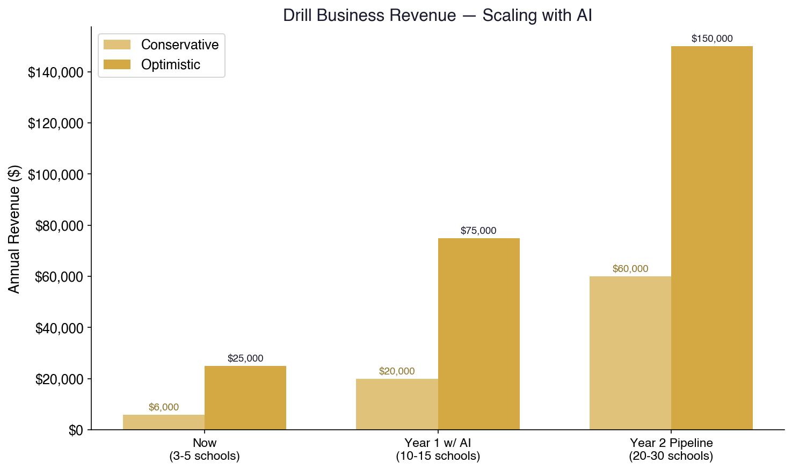
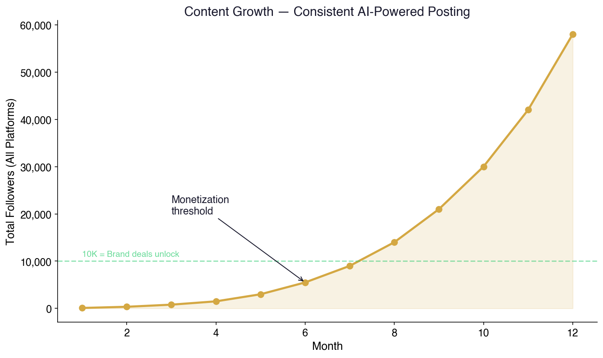
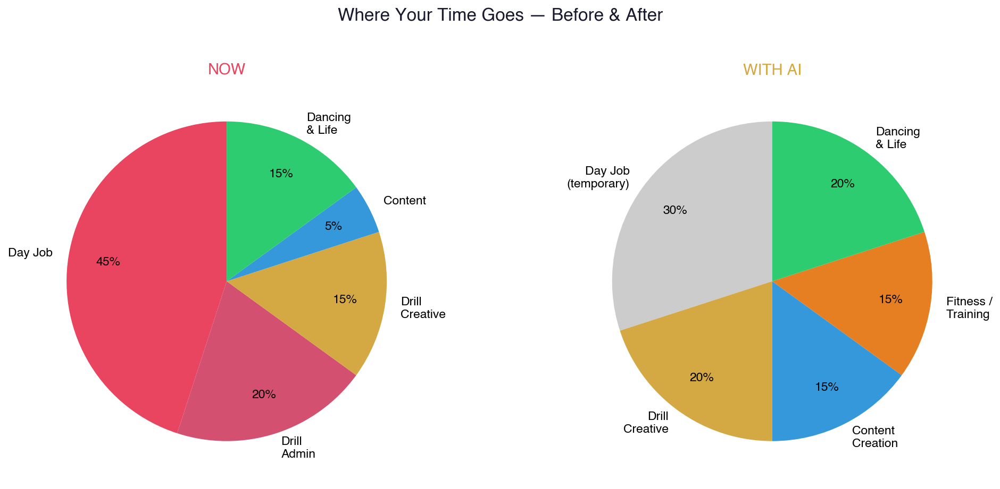
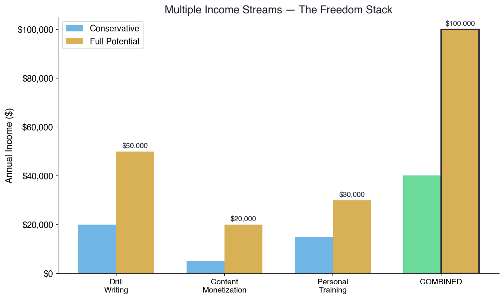

# Your Path to Financial Freedom Starts With a $30/Month Machine
## A Playbook for Zach Rodgers — Creator, Drill Writer, Future Empire

*Written by Deacon Ridley — who rebuilt his entire AI system from scratch in 12 hours. Four personalized guides written and delivered tonight. This is the fifth. The machine doesn't sleep.*

---

## Here's What I See

You've got something most people don't — the ability to walk into any room and light it up. You're fit, you're creative, you're magnetic. People are drawn to you. That's not something you can teach or automate.

But right now that gift is trapped behind a job you don't love, a drill writing business that can't scale because there's only one of you, and a dozen creative ambitions — fitness content, personal training, country dancing, music, art — that keep getting pushed to "someday."

What if someday was next month?

---

## The Problem Is Simple

You're a one-man show trying to do the work of ten:

- **Drill writing:** Choreography, music editing, coordination with band directors, scheduling rehearsals, managing multiple schools — each one is a mini-project that eats hours
- **Client acquisition:** Finding new schools, pitching, following up, closing deals — all on you
- **Day job:** Taking your time and energy and giving it to something you don't care about
- **Content dreams:** Fitness videos, personal training marketing, creative projects — always "when I have time"

The bottleneck isn't talent. It's bandwidth. And bandwidth is exactly what this tool gives you back.

---

## What I Built in 12 Hours

I'm not theorizing. Last night I reset my entire AI system and rebuilt from scratch. Here's what exists right now:

- ✅ Automated email sorting — 19 categories, runs every 2 hours
- ✅ Full ROI presentation for my financial firm — $39-52K/year in savings projected
- ✅ Four personalized business guides for four different friends — written, charted, PDF'd, emailed
- ✅ Calendar automation, research pipelines, daily briefings — all running
- ✅ AI video generation configured and ready
- ✅ Content creation pipeline built

One person. 12 hours. $30/month. Now imagine what you build in a week when you actually apply it to drill, fitness, and content.

---

## Part 1: Scaling the Drill Business

This is your money-right-now play. You already have the skill, the connections, and the reputation. You just can't clone yourself. Until now.

### What the Agent Does for Drill

**Music & Choreography Assistance**
- Feed the agent a song, a theme, a vibe — it helps generate choreography concepts, formation ideas, and transition sequences
- It can analyze music tracks — BPM, beat drops, key changes — and map choreography suggestions to the structure
- Reference library: upload your past routines. The agent learns your style and suggests variations that feel like you, not generic AI

**Client Management at Scale**
Right now you're probably managing schools through texts, DMs, and memory. The agent builds you a real operation:

```
┌──────────────────────────────────────────────┐
│           ZACH'S DRILL COMMAND CENTER          │
│                                                │
│  ┌──────────┐  ┌──────────┐  ┌─────────────┐ │
│  │  Schools  │  │ Schedule │  │  Routines   │ │
│  │    DB     │→ │  Tracker │→ │   Library   │ │
│  └──────────┘  └──────────┘  └─────────────┘ │
│       ↑              ↑             ↑          │
│  ┌──────────┐  ┌──────────┐  ┌─────────────┐ │
│  │ Outreach │  │  Email   │  │   Music     │ │
│  │  Engine  │  │  Auto    │  │   Analysis  │ │
│  └──────────┘  └──────────┘  └─────────────┘ │
│                                                │
│  Interface: Your Phone (Telegram / Text)       │
│  Cost: $30/month                               │
└──────────────────────────────────────────────┘
```

- **Every school tracked** — band director name, contact info, competition dates, rehearsal schedule, budget, routine status
- **Automated reminders** — "Competition in 2 weeks for Allen HS. Final rehearsal Thursday. Music file sent."
- **Invoice generation** — the agent tracks what you're owed and sends invoices automatically
- **Follow-ups** — band director hasn't responded in 5 days? Agent sends a polite check-in. You never chase.

**Prospecting New Schools**
This is where it explodes. Right now you get schools through word of mouth. What if the agent:

- **Scraped every high school in Texas** with a drill team or dance program
- **Found the band director's name and email** from school websites
- **Generated personalized outreach** — "I noticed Plano Senior's drill team placed 3rd at state last year. I've worked with [school names] on routines that took them from regionals to finals. Would love to chat about what you have planned for next season."
- **Tracked responses** and followed up automatically
- **Scheduled calls and meetings** when they reply

You go from working with however many schools you can personally manage to having a pipeline of dozens. The agent handles the outreach. You handle the artistry.



### The Math on Scaling

| Scenario | Schools | Revenue/School | Annual |
|----------|---------|---------------|--------|
| Now (solo, manual) | 3-5 | $2,000-5,000 | $6,000-25,000 |
| With AI (scaled outreach) | 10-15 | $2,000-5,000 | $20,000-75,000 |
| Full pipeline (Year 2) | 20-30 | $3,000-5,000 | $60,000-150,000 |

At 20+ schools, this isn't a side hustle anymore. It's a business that replaces your day job. And the only thing that changed is you stopped doing the admin work manually.

---

## Part 2: The Content Machine

You've wanted to create content for a long time. Fitness. Lifestyle. Dance. Creativity. The barrier has always been time and production overhead.

That barrier is gone.

### Fitness Content
You're already in shape. You already know what works. The content writes itself — you just need the machine to actually produce it:

- **Script generation** — describe a workout, a tip, a transformation story. The agent writes a script optimized for YouTube Shorts, TikTok, or Instagram Reels.
- **AI video generation** — text-to-video tools create stunning visuals. No camera crew, no studio, no editing software. Describe the scene, get the video.
- **Thumbnail and graphics** — AI generates eye-catching thumbnails and social graphics for every post
- **Multi-platform posting** — one piece of content automatically reformatted and posted across YouTube, TikTok, Instagram, X
- **Trending analysis** — the agent monitors what's performing in fitness content right now and suggests topics that'll get views

People are getting **millions of views** with AI content this month. One guy — Oliver Henry — gave his agent a content strategy and hit millions of TikTok views in one week. One person. One agent.

### Personal Training Marketing
If you decide to pursue personal training, the agent is your entire marketing department:

- **Client acquisition** — scrape local fitness communities, gym-goers, social media for potential clients
- **Landing page** — the agent can build you a simple website or booking page
- **Automated booking** — prospects book sessions, get confirmations, get reminders. Zero admin from you.
- **Transformation tracking** — log client progress, generate before/after content, build social proof
- **Email campaigns** — nurture sequences for leads, check-ins for past clients, referral requests

### Dance & Creative Content
Country dancing, drill highlights, creative projects — all of this is content waiting to happen:

- Film a 30-second dance clip → the agent adds music, captions, effects, and posts it
- Your drill teams performing → highlight reels generated and shared (with school permission)
- Behind-the-scenes of your creative process → the agent scripts and packages it

The algorithm rewards consistency. The agent gives you consistency without burning out.



---

## Part 3: Freeing Your Mind

Let's talk about the real payoff. Not the money — the freedom.



### What Your Week Looks Like Now
```
Monday-Friday: Job you don't love (draining)
Evenings: Drill work (emails, music editing, logistics)
Weekends: Rehearsals + catching up on everything else
Content creation: "When I have time" (never)
Country dancing: "When I have time" (barely)
Life: On hold
```

### What Your Week Looks Like With the Machine
```
Monday-Friday: Job (same for now, but—)
  → Drill admin runs itself (outreach, scheduling, invoicing)
  → Emails sorted, follow-ups automated
  → Content posted automatically from last week's batch
Evenings: FREE — create, dance, live
Weekends: Rehearsals (just the fun part) + whatever you want
Content: Running on autopilot
Country dancing: Whenever you want
Life: Happening
```

The day job becomes temporary because the drill business scales to replace it. The content builds an audience while you sleep. The personal training pipeline fills itself. And you — you get to be the version of yourself that exists when the admin work disappears.

### Daily Digest
Every morning:

- New school inquiries and where they stand
- Drill schedule for the week
- Content performance from yesterday's posts
- Emails that actually need your attention (everything else handled)
- Fitness content ideas trending right now
- Any follow-ups due today

You know exactly what needs you and what doesn't. The machine handles the "doesn't" category. You focus on the "does."

---

## Part 4: The Freedom Math

### Getting Off the Clock
You don't want to work with your hands forever. Here's the bridge:

```
Drill business (scaled to 10 schools)    = $20,000-50,000/year
Content monetization (YouTube/TikTok)    = $5,000-20,000/year
Personal training (5 clients)            = $15,000-30,000/year
────────────────────────────────────────────────────
Total: $40,000-100,000/year
```



All three run with heavy automation. The drill outreach is automated. The content posts itself. The training clients book themselves. You show up for the parts that need you — the artistry, the workouts, the face-to-face. Everything else is handled.

That's financial freedom. Not "rich" — free. Free to country dance on a Wednesday. Free to take a road trip. Free to say no to work that drains you and yes to everything that lights you up.

### The Cost

| Item | Cost |
|------|------|
| OpenClaw software | **$0** — forever |
| Computer | Use what you have, or ~$500 for a Mac Mini |
| AI models | ~$30/month |
| **Total** | **~$30/month** |

$30/month. That's one night out. One tank of gas. For a 24/7 assistant that manages your business, creates your content, and gives you your life back.

---

## Part 5: Why Now

Every day without this running is:
- Schools you didn't reach out to
- Content you didn't post
- Followers you didn't gain
- Clients you didn't book
- Money you didn't make
- Freedom you didn't build

The people who started two weeks ago already have memory systems, automated workflows, and content pipelines generating views while they sleep. The tools compound. Every day the machine runs, it gets smarter, your audience grows, your business scales.

The window is right now. The tools just hit a tipping point in the last 30 days. I rebuilt my entire system in 12 hours — and I'm not more technical than you. I just started.

---

## What Others Are Doing This Month

Real people. Real results. Right now:

- **Oliver Henry** — millions of TikTok views in one week with an AI content agent
- **Vadim Strizheus** — 9 AI employees running 24/7, built in 7 days. Including a 24/7 clipping agent that makes short-form content automatically.
- **@sentientt_media** — $100K/year one-person business, fully AI-powered
- **@jackfriks** — published two skills that generate millions of TikTok views. Free. Open source.
- **Deacon Ridley** — full operational system in 12 hours. Five personalized business guides written and emailed tonight. You're reading one of them.

---

## Next Steps

1. **Call me.** I'll walk you through what I've built.
2. **30 minutes.** That's all setup takes. I'll help.
3. **Pick one thing** — drill outreach, fitness content, whatever — and let the agent start tonight.
4. **Check in one week.** See where it's at. Then decide if you want to keep going.

You were built for more than a day job you don't love. The creativity, the energy, the ability to connect with people — that's your superpower. The machine handles everything that isn't.

This is your path to financial freedom, Zach. The only question is when you start walking it.

---

*Built with OpenClaw 🔮 — the same tool that wrote, formatted, and delivered this document.*

*Questions? Call Deacon.*
